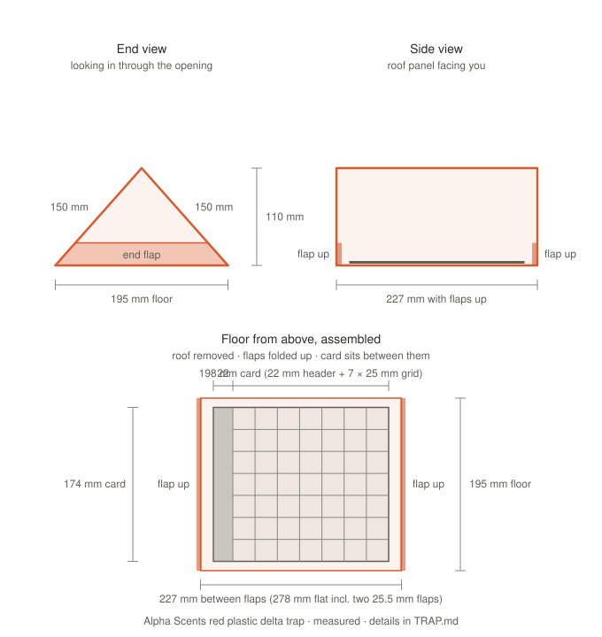

# The trap: Alpha Scents plastic delta trap (red)

We use the [Alpha Scents plastic delta trap, red](https://alphascents.com/products/plastic-delta-trap-red-complete-includes-sticky-insert-and-hanger)
(corrugated plastic, sold with a sticky insert and hanger) with the
[Alpha Scents plastic delta insert card](https://alphascents.com/products/plastic-delta-trap-sticky-insert).
Alpha Scents doesn't publish the trap's size; everything below was measured with a ruler on a real
trap and card.

## Trap

| What | mm |
|---|---|
| Roof panels (each side of the triangle) | 150 |
| Floor width (bottom of the triangle) | 195 |
| Floor to inside roof peak | 110 |
| Length, end flaps folded up (open end to open end) | 227 |
| Length laid flat (flaps unfolded) | 278 |
| End flaps, one at each opening | 25.5 = (278 − 227) / 2 |

The end flaps sit on the short sides of the floor rectangle, at the two triangular openings. When the
trap is assembled they fold up, and the sticky card sits on the floor between them.

150 mm panels over a 195 mm floor work out to a 114 mm peak; the measured 110 mm is what the
camera numbers use.

## Sticky card

| What | mm |
|---|---|
| Card | 174 across the trap × 198 along it |
| Printed header ("Plastic Delta Insert Card") at one end | 174 × 22 |
| Grid | 7 × 7 squares, **25 mm** (not 1 in): `SENTINEL_GRID_MM=25` |

Centred on the floor, the card leaves about 10.5 mm of floor on each side and 14.5 mm at each end.

## What this means for the camera

The peak is low. With the Camera Module 3 Wide (102° × 67°) the view across the trap is the tight
direction, and covering the card's 174 mm needs the lens about **131 mm** above it (150 mm for some
margin), which is 21–40 mm *above* the roof peak. From inside, the camera misses the card's edges:

| Lens above the card | View along × across (mm) | Whole card? |
|---|---|---|
| 85 mm (mount 25 mm below the peak) | 210 × 113 | no |
| 110 mm (lens at the peak) | 272 × 146 | no, ~14 mm missed on each side |
| 150 mm (roof housing, 40 mm above the peak) | 370 × 199 | yes, ~13 px/mm |

Check any layout with `python mockup_template.py --cam-drop <mm>` (a negative drop puts the lens
above the peak). The slide-in tray in `scad/liner_tray.scad` (markers in an 18 mm rim) is wider than
this floor and needs a redesign before printing.
